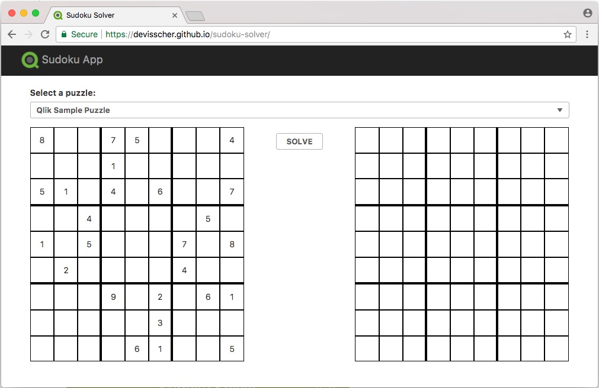

# Sudoku Solver

Welcome to Sudoku Solver. This app was built to demonstrate the use of a backtracking algorithm in JavaScript. The algorithm checks empty values, eliminating candidates until it has found a correct value. If the app finds a conflict, it backtracks, modifies the candidate and continues until it has solved the sudoku.

The app was built using Angular(4.4.4).

To add or change the puzzles loaded, edit `src/app/data/mock-sudoku.ts` file. The app takes an array of sudoku objects like the following.

```
// src/app/data/mock-sudoku.ts

{
    id: 1,
    name: 'Qlik Sample Puzzle',
    data: [
        [8, 0, 0, 7, 5, 0, 0, 0, 4],
        [0, 0, 0, 1, 0, 0, 0, 0, 0],
        [5, 1, 0, 4, 0, 6, 0, 0, 7],
        [0, 0, 4, 0, 0, 0, 0, 5, 0],
        [1, 0, 5, 0, 0, 0, 7, 0, 8],
        [0, 2, 0, 0, 0, 0, 4, 0, 0],
        [0, 0, 0, 9, 0, 2, 0, 6, 1],
        [0, 0, 0, 0, 0, 3, 0, 0, 0],
        [0, 0, 0, 0, 6, 1, 0, 0, 5]
    ]
}
```

The app can be found here: https://devisscher.github.io/sudoku-solver/

## Run the project

### Install modules

`npm install`

### and run the app

`npm start`

## Build

Run `npm run prod` to build the project. The build artifacts will be stored in the `dist/` directory. Adjust the --base-href to the path of the project folder to load all assets properly.

## Running unit tests

Run `npm test` to execute the unit tests via [Karma](https://karma-runner.github.io).

## Deploying to GitHub Pages

Run `npm run gh` to deploy to GitHub Pages.

## Generating documentation

Run `npm run compodoc`

## Using the app

The app renders 2 grids. The left side grid contains the puzzle to be solved and the right side grid is empty to start. By default the first puzzle is loaded however you can select a different puzzle with the dropdown list. Clicking solve will display the solution on the right.

## Screenshot


